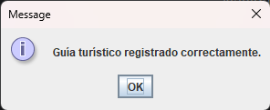
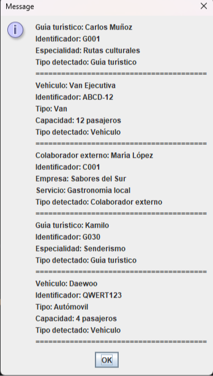

# 🌄 Llanquihue Tour - Semana 8

Proyecto desarrollado para la asignatura **Desarrollo Orientado a Objetos I** de **Duoc UC**.

En esta versión del proyecto se amplía el sistema de la agencia turística **Llanquihue Tour**, incorporando conceptos fundamentales de la Programación Orientada a Objetos como **interfaces, herencia, polimorfismo, uso de `instanceof`, colecciones genéricas y una interfaz gráfica con JOptionPane**.

---

## 📌 Objetivo

Desarrollar un sistema capaz de gestionar distintas entidades de una agencia de turismo mediante una arquitectura orientada a objetos, permitiendo registrar y visualizar información desde una interfaz gráfica sencilla.

---

# 🚀 Tecnologías utilizadas

- Java 23
- IntelliJ IDEA
- Maven
- JOptionPane (Swing)
- Git
- GitHub

---

# 📂 Estructura del proyecto

```
src
└── main
    └── java
        ├── data
        │   ├── GestorServicios.java
        │   └── GestorEntidades.java
        │
        ├── model
        │   ├── ServicioTuristico.java
        │   ├── RutaGastronomica.java
        │   ├── PaseoLacustre.java
        │   ├── ExcursionCultural.java
        │   ├── Registrable.java
        │   ├── RecursoAgencia.java
        │   ├── GuiaTuristico.java
        │   ├── Vehiculo.java
        │   └── ColaboradorExterno.java
        │
        └── ui
            ├── Main.java
            └── VentanaEntidades.java
```

---

# 🧩 Funcionalidades

✅ Gestión de entidades mediante una interfaz común (`Registrable`).

✅ Implementación de herencia utilizando la clase abstracta `RecursoAgencia`.

✅ Polimorfismo mediante `ArrayList<Registrable>`.

✅ Identificación de tipos utilizando `instanceof`.

✅ Registro de:

- Guías turísticos
- Vehículos

✅ Visualización de entidades registradas.

✅ Validación de datos:

- Campos vacíos.
- Cancelación de ingreso.
- Validación de números.
- Opciones inválidas del menú.

✅ Interfaz gráfica desarrollada con JOptionPane.

---

# 📷 Capturas del proyecto

## Menú principal


---

## Registro de guía turístico



---

## Registro de vehículo


---

## Entidades registradas



---

# ▶️ Cómo ejecutar

1. Clonar el repositorio.

```
git clone https://github.com/TU-USUARIO/LLanquihueTour_S8.git
```

2. Abrir el proyecto con IntelliJ IDEA.

3. Esperar que Maven descargue las dependencias.

4. Ejecutar:

```
ui.Main
```

---

# 💻 Conceptos aplicados

- Programación Orientada a Objetos (POO)
- Herencia
- Interfaces
- Polimorfismo
- Clases abstractas
- Colecciones (`ArrayList`)
- Uso de `instanceof`
- Validación de datos
- Interfaz gráfica con Swing (`JOptionPane`)

---

# 👨‍💻 Autor

**Sebastián Ignacio Ávila Sanhueza**

Estudiante de Analista Programador Computacional

Duoc UC

---

# 📚 Asignatura

**Desarrollo Orientado a Objetos I**

Actividad Sumativa — Semana 8

Duoc UC
