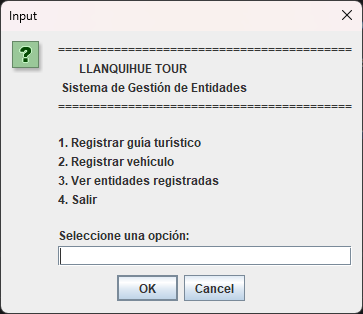
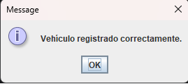

# Llanquihue Tour - Semana 8

Proyecto desarrollado para la asignatura **Desarrollo Orientado a Objetos I** de **Duoc UC**.

Esta versión corresponde a la **Actividad Sumativa de la Semana 8**, donde se amplía el sistema de la agencia turística **Llanquihue Tour** aplicando conceptos fundamentales de Programación Orientada a Objetos como interfaces, herencia, polimorfismo, colecciones genéricas, uso de `instanceof` e interfaz gráfica mediante `JOptionPane`.

---

# 📌 Objetivo del proyecto

Desarrollar un sistema orientado a objetos que permita gestionar distintas entidades de una agencia de turismo mediante una interfaz gráfica simple, reutilizando la estructura creada en las actividades anteriores e incorporando nuevos conceptos de Java.

---

# 📌 Tecnologías utilizadas

- Java 23
- IntelliJ IDEA
- Maven
- Swing (JOptionPane)
- Git
- GitHub

---

# 📂 Estructura del proyecto

```
LLanquihueTour_S8
│
├── images
│
├── src
│   └── main
│       └── java
│
│           ├── data
│           │      GestorServicios.java
│           │      GestorEntidades.java
│           │
│           ├── model
│           │      ServicioTuristico.java
│           │      RutaGastronomica.java
│           │      PaseoLacustre.java
│           │      ExcursionCultural.java
│           │
│           │      Registrable.java
│           │      RecursoAgencia.java
│           │      GuiaTuristico.java
│           │      Vehiculo.java
│           │      ColaboradorExterno.java
│           │
│           └── ui
│                  Main.java
│                  VentanaEntidades.java
│
├── pom.xml
└── README.md
```

---

# 📌 Funcionalidades

- Registro de guías turísticos.
- Registro de vehículos.
- Visualización de entidades registradas.
- Implementación de interfaces.
- Uso de herencia mediante una clase abstracta.
- Aplicación de polimorfismo.
- Uso de `ArrayList<Registrable>`.
- Identificación de objetos utilizando `instanceof`.
- Validación de datos ingresados por el usuario.
- Interfaz gráfica desarrollada con `JOptionPane`.

---

# 💻 Conceptos de Programación Orientada a Objetos aplicados

## Interfaces

Se implementó la interfaz **Registrable**, permitiendo que distintas entidades compartan un comportamiento común mediante el método `mostrarResumen()`.

---

## Herencia

Las clases:

- GuiaTuristico
- Vehiculo
- ColaboradorExterno

heredan de la clase abstracta **RecursoAgencia**, reutilizando atributos y comportamiento común.

---

## Polimorfismo

Todas las entidades se almacenan dentro de una colección:

```java
ArrayList<Registrable>
```

permitiendo trabajar con diferentes tipos de objetos utilizando una misma referencia.

---

## instanceof

Durante el recorrido de la colección se utiliza el operador `instanceof` para identificar el tipo específico de cada objeto y mostrar información personalizada.

---

# 📷 Capturas del proyecto

## 🏠 Menú principal

Pantalla inicial del sistema, donde el usuario puede acceder a las distintas opciones disponibles para registrar y visualizar entidades de la agencia.



---

## 👨‍💼 Registro de guía turístico

Ejemplo del registro exitoso de un guía turístico utilizando la interfaz gráfica desarrollada con `JOptionPane`.


---

## 🚐 Registro de vehículo

Confirmación del registro exitoso de un vehículo perteneciente a la agencia turística.



---

## 📋 Visualización de entidades registradas

Listado completo de las entidades almacenadas en la colección `ArrayList<Registrable>`, mostrando además la identificación del tipo mediante `instanceof`.


---

# ▶️ Cómo ejecutar el proyecto

1. Clonar el repositorio

```bash
git clone https://github.com/Sebastian6161/LLanquihueTour_S8.git
```

2. Abrir el proyecto con IntelliJ IDEA.

3. Esperar que Maven descargue las dependencias.

4. Ejecutar la clase:

```
ui.Main
```

---

# 📚 Aprendizajes obtenidos

Durante el desarrollo de esta actividad se reforzaron los siguientes contenidos:

- Programación Orientada a Objetos.
- Interfaces.
- Clases abstractas.
- Herencia.
- Polimorfismo.
- Colecciones (`ArrayList`).
- Operador `instanceof`.
- Validación de datos.
- Desarrollo de interfaces gráficas básicas con Swing (`JOptionPane`).
- Organización de proyectos Maven.
- Control de versiones con Git y GitHub.

---

# 👨‍💻 Autor

**Sebastián Ignacio Ávila Sanhueza**

Estudiante de Analista Programador Computacional

Duoc UC

---

# 📖 Asignatura

**Desarrollo Orientado a Objetos I**

Actividad Sumativa — Semana 8

Duoc UC
